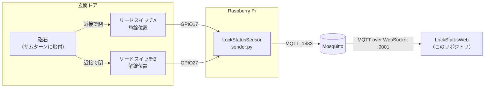

# LockStatusWeb

施錠状態を MQTT over WebSocket で購読して表示する Web UI。

> 旧 README に貼っていたスクリーンショットは、表示項目（警告表示・最終更新時刻）が増える前のものだったため削除した。撮り直して貼り直すこと。

## 全体構成



HTTP API は経由しない。以前あった LockStatusApi は MQTT 一本化にともない廃止した。

## 購読するトピック

| トピック | 内容 |
| --- | --- |
| `lock/status` | `{"state": "locked" \| "unlocked" \| "unknown", "ts": <epoch秒>}`（retain付き） |
| `lock/availability` | `online` / `offline`（retain付き。offline はセンサー側の LWT） |

retain が付いているので、ページを開いた時点で最新状態が即座に届く。

## 表示の考え方

**断定できないときは「施錠中」も「解錠中」も出さない。**

- ブローカーに接続できていない → `不明` ＋「MQTTブローカーに接続できていません」
- `lock/availability` が `offline` → `不明` ＋「センサーが応答していません」
- `lock/status` が `unknown`（両接点開＝磁石の脱落など） → `不明`

最後に見た「施錠中」を出し続けるのが一番危険なので、そうしない。初期値も `不明` で、`解錠中` ではない。

## セットアップ

```bash
npm install
cp .env.example .env
```

`.env` の `REACT_APP_MQTT_URL` をブローカーのアドレスに合わせる。

```
REACT_APP_MQTT_URL=ws://192.168.3.13:9001
```

**ポートは 9001（WebSocket）であって 1883 ではない。** ブラウザは生の MQTT に接続できないため、Mosquitto 側に WebSocket リスナーが必要になる。設定は LockStatusSensor リポジトリの `mosquitto.example.conf` を参照。

```
listener 9001
protocol websockets
```

## 実行

```bash
npm start     # 開発サーバー
npm run build # 本番ビルド
```

`REACT_APP_MQTT_URL` が未設定の場合は起動時に明示的にエラーを投げる。接続エラーに紛れて原因が分からなくなるのを避けるため。

## 構成

| パス | 役割 |
| --- | --- |
| `src/hooks/useLockStatus.ts` | MQTT 接続・購読・状態の組み立て |
| `src/components/LockStatus.tsx` | 表示のみ |
| `src/App.tsx` | ルート |

## 未対応

- **認証・TLS**: `ws://` のまま。LAN 外に出すなら `wss://` と認証が必須。
- **鮮度判定**: `ts` を受け取って表示はしているが、「N分以上古ければ警告」という判定は入れていない。`availability` で足りているため。
